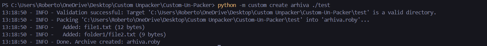
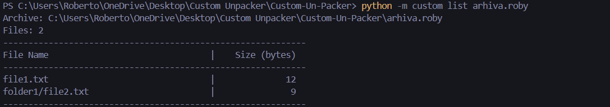
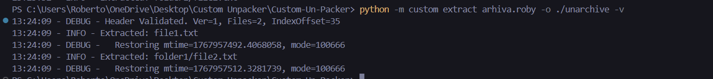

# Custom (Un)Packer (`.roby`)

> **A robust, pure-Python command-line tool for creating and managing custom archive formats.**

##  Overview

**Custom (Un)Packer** is a specialized CLI utility designed to handle a custom non-compressed archive format (`.roby`). Built with a focus on strict validation, data integrity, and deterministic behavior, it provides a reliable way to serialize directory structures into a single binary file and restore them with high fidelity.

This project was developed to demonstrate low-level file manipulation, binary structure design, and robust CLI engineering in Python.

##  Key Features

*   **Deterministic Packing**: Ensures reproducible builds by sorting files and directories before packing.
*   **Data Integrity**: Implements SHA-256 checksum validation for every file entry to detect corruption.
*   **Metadata Preservation**: Captures and restores file modification times (`mtime`) and permissions (`mode`).
*   **Selective Extraction**: Support for unpacking specific files or entire archives.
*   **Streaming I/O**: Efficiently handles large files using chunk-based reading/writing (64KB buffers) to minimize memory usage.
*   **Strict Validation**: Input paths and archive headers are rigorously validated to prevent errors.

##  Architecture & File Format

The `.roby` format uses a binary structure designed for fast indexing and sequential reading.

### 1. Header (Fixed Size)
Contains global metadata about the archive.
*   **Magic Bytes**: `ROBY` (4 bytes) - Identifies the file type.
*   **Version**: `1` (2 bytes, unsigned short).
*   **File Count**: Total number of files (4 bytes, unsigned int).
*   **Index Offset**: Byte pointer to the start of the Index section (4 bytes, unsigned int).

### 2. Data Section
Raw file contents are written sequentially. This ensures that data writing is continuous, optimizing for write speed during creation.

### 3. Index Section (Variable Size)
Located at the end of the file (pointed to by `Index Offset`). It allows for quick listing of contents without reading the entire archive. Each entry contains:
*   **Path Length** & **Path String** (UTF-8).
*   **File Size** & **Content Offset**.
*   **SHA-256 Checksum** (32 bytes).
*   **Metadata**: `mtime` (double) and `file_mode` (int).

##  Getting Started

### Prerequisites

*   Python 3.8 or higher.
*   No external dependencies required (uses standard library only).

### Installation

Clone the repository:

```bash
git clone https://github.com/yourusername/Custom-Un-Packer.git
cd Custom-Un-Packer
```

## Usage

The tool is invoked via the `custom` module.

### 1. Create an Archive
Pack a directory into a `.roby` archive.

```bash
# Syntax: create <archive_name> <source_dir>
python -m custom create arhive ./test
```



### 2. List Contents
View files inside an archive without extracting them.

```bash
# Syntax: list <archive_name>
python -m custom list archive.roby
```


### 3. Full Extraction
Extract the entire archive to a destination folder.

```bash
# Syntax: extract <archive_name> -o <output_dir>
python -m custom extract archive.roby -o ./unarchive
```



### 4. Selective Extraction
Extract only specific files.

```bash
# Syntax: extract <archive_name> <file1> <file2> ...
python -m custom extract archive.roby config.json images/logo.png -o ./out
```

### Running Tests
The project includes a suite of integration tests to verify packing, unpacking, and error handling.

```bash
python -m unittest discover tests
```

##  Support & Assistance

If you have any questions, run into issues, or need help with this project, please treat free to contact me at: **robertoissues1@gmail.com**


